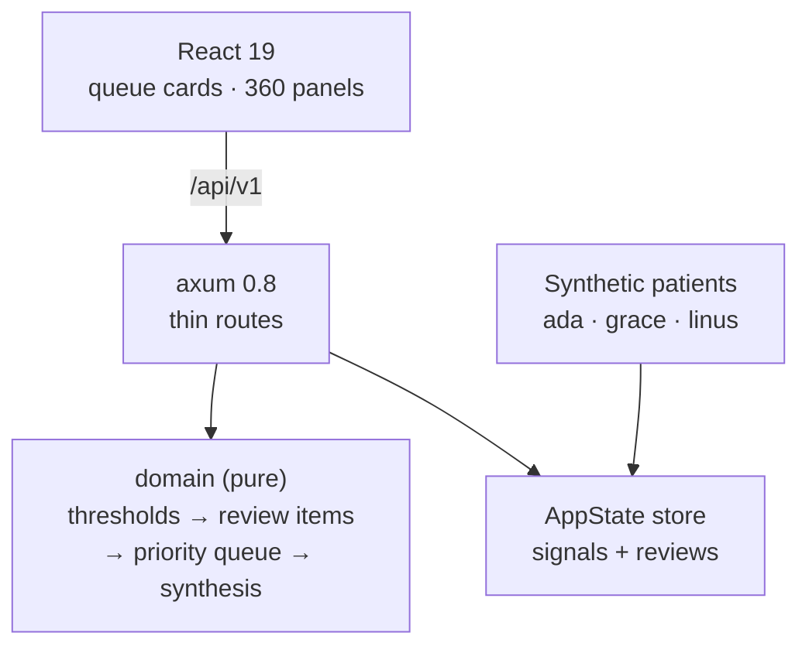

<p align="center">
  <h1>🧑‍⚕️ Patient 360 Dashboard</h1>
  <p><b>Physician Copilot — multi-source aggregation, priority queue, AI synthesis, review workflow</b></p>
  <p>
    <a href="https://github.com/akarales/patient-360-dashboard/actions/workflows/ci.yml"></a>
    
    
    
    
  </p>
</p>

A physician Copilot in miniature: aggregate patient data from multiple sources
(labs, vitals, wearables), derive risk signals from **documented
threshold bands**, surface a physician **priority queue** (risk-sorted),
generate an **AI synthesis** narrative (stub mode default), and run the
**review workflow** — acknowledge / escalate. Rust (axum) with pure
domain logic; React client.

**Jump to:** [Features](#-features) · [Architecture](#-architecture) · [Quickstart](#-quickstart) · [Configuration](#️-configuration) · [API](#-api) · [Docs](#-documentation) · [Roadmap](#️-roadmap)

> [!WARNING]
> Demo with synthetic patients. Risk items and syntheses are
> informational — not clinical decision support, not medical advice.

## ⚡ Features

- **Multi-source aggregation** — labs, vitals, and wearables grouped
  per patient into a single 360 view
- **Documented risk derivation** — threshold bands per biomarker
  (HBA1C, LDL, systolic BP, HR, HRV) with weights; deterministic and
  unit-tested
- **Physician priority queue** — pending items sorted by risk, recency
  tiebreak; acknowledged items leave the queue
- **AI synthesis with disclaimers** — deterministic stub narrative tied
  to the highest-risk item
- **Review workflow state machine** — pending → acknowledged /
  escalated, visible end-to-end in the UI

## 📐 Architecture



## 🚀 Quickstart

```bash
cargo run               # :8007 — seeded with 3 synthetic patients
cd frontend && pnpm install && pnpm dev   # → http://localhost:5173
```

The seed: ada (labs drift — HBA1C high, LDL borderline), grace (vitals +
wearables — BP high, HRV low), linus (healthy control with no items).

## ⚙️ Configuration

| Variable | Default | Notes |
|----------|---------|-------|
| `APP_PORT` | `8007` | 8000–8006 taken on this machine |

## 📡 API

| Endpoint | Purpose |
|----------|---------|
| `GET /health` | liveness |
| `GET /api/v1/patients` | patients with their data sources |
| `GET /api/v1/queue` | physician priority queue (risk-sorted) |
| `GET /api/v1/patients/{id}/360` | all signals grouped by source + items |
| `POST /api/v1/patients/{id}/synthesis` | AI narrative for top risk item |
| `POST /api/v1/reviews/{id}` | `{action: acknowledge\|escalate}` |

curl + JSON: [docs/API.md](docs/API.md).

## 📚 Documentation

| Page | What's inside |
|------|---------------|
| [docs/ARCHITECTURE.md](docs/ARCHITECTURE.md) | Domain model, threshold table, queue ordering, workflow states |
| [docs/API.md](docs/API.md) | Queue/360/synthesis/review endpoints with payloads |
| [docs/DEVELOPMENT.md](docs/DEVELOPMENT.md) | Setup, testing, extending the threshold table |

## 🗺️ Roadmap

<details>
<summary>Phased plan</summary>

- [x] Phase 0 — scaffold: aggregation, queue, synthesis, workflow, CI
- [ ] Phase 1 — FHIR ingest (reuses the fhir-r4-explorer models) +
      Postgres store
- [ ] Phase 2 — real LLM synthesis (Ollama, schema-constrained)
- [ ] Phase 3 — drift integration from the biomarker-trend-analyzer

</details>

## 🤝 Contributing

PRs welcome — see [CONTRIBUTING.md](CONTRIBUTING.md). Gates: `cargo
clippy --all-targets -- -D warnings`, `cargo test -q`, `pnpm build`.

## 📄 License

MIT — see [LICENSE](LICENSE).
